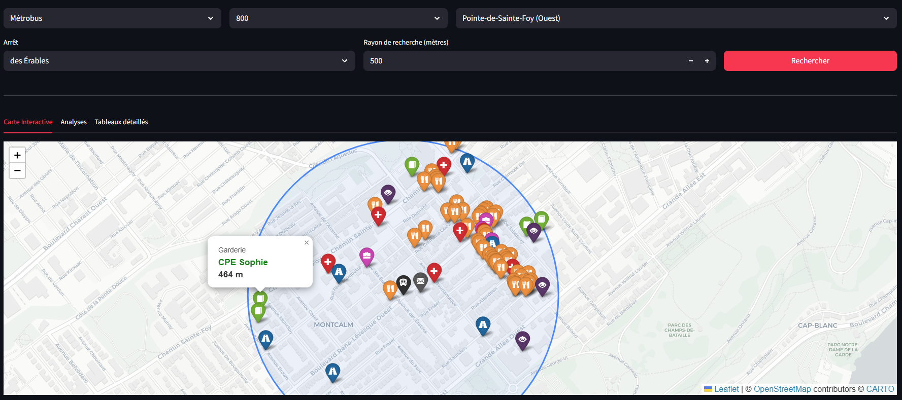
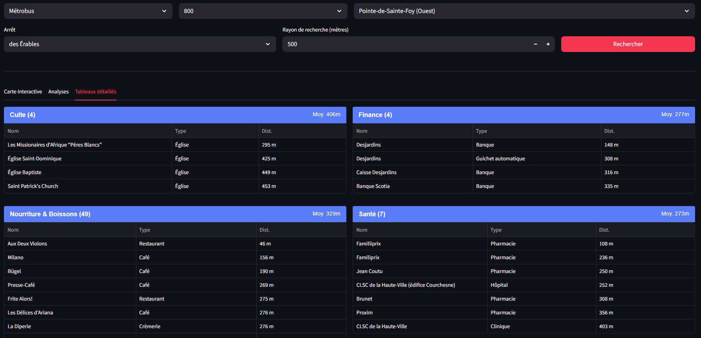

# Explorer les arrêts du RTC
Ce projet se présente sous la forme d'un tableau de bord interactif. Il permet d'analyser l'accessibilité urbaine dans la ville de Québec en croisant les données du réseau de transport en commun avec les services de proximité. L'outil répond à une question : **à quelle distance se trouvent les services essentiels (santé, éducation, commerces, ...) d'un arrêt de bus du RTC ?**

Grâce à des filtres, l'utilisateur peut sélectionner un parcours et un arrêt spécifique pour visualiser les services environnants. 

## Les Données
Les données utilisées pour construire ce tableau de bord sont publiques  et viennent des sources suivantes : 

| Donnée | Source | Date de consultation |
| :--- | :--- | :--- |
| **Réseau de Transport** | [Données Québec (RTC)](https://www.donneesquebec.ca/recherche/dataset/rtc-gtfs-arrets-et-les-parcours) | **5 janvier 2026** |
| **Points d'Intérêt** | OpenStreetMap (Données Places & Amenities) | **5 janvier 2026** |
| **Documentation** | [GTFS.org](https://gtfs.org/documentation/schedule/reference/) | - |

---
## Aperçu du tableau de bord

*Vue de la carte interactive et de la zone de recherche autour de l'arrêt choisi*

*Détail des résultats sur les lieux à proximité*

###### Coût : 0 $ 